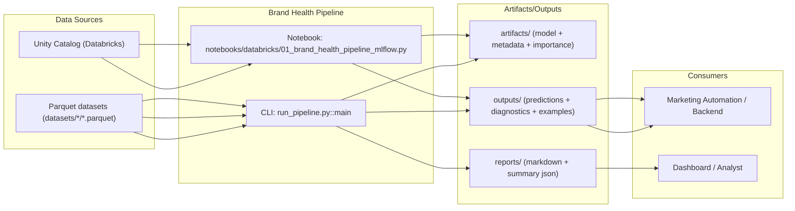
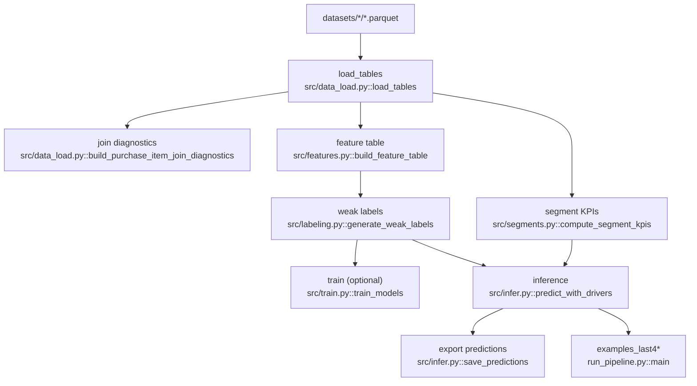
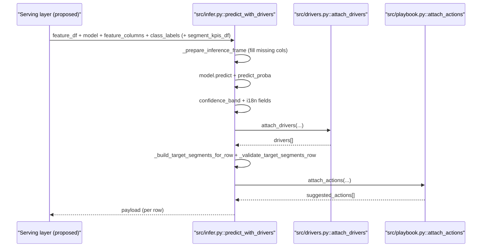
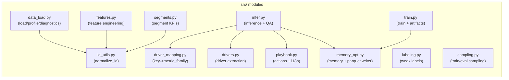
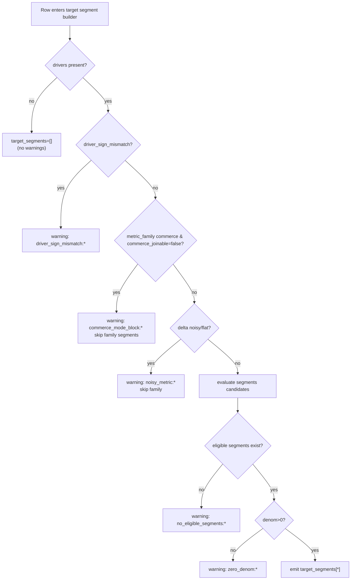

# 07 — Diagrams (Mermaid)

## Purpose
รวม diagram ด้วย Mermaid เพื่ออธิบายระบบแบบ end-to-end: system context, data flow, sequence, component, และ failure/fallback flows

**หลักฐานใน repo:** pipeline orchestration: `run_pipeline.py::main`, inference: `src/infer.py::predict_with_drivers`, export: `src/infer.py::save_predictions`

## What you will learn
- ใครเรียกใคร และ artifact/output ไหลไปไหน
- ขั้นตอน transformations ที่สำคัญสำหรับ inference/explain/action
- จุด failure และ fallback behavior ที่ต้องเตรียมใน infra/monitoring

**หลักฐานใน repo:** warnings/guardrails: `src/infer.py::_build_target_segments_for_row`, `src/playbook.py::map_drivers_to_actions`

## Definitions/Glossary
- **Context diagram**: มองระบบจากมุมผู้เรียก/ผู้ใช้ output
- **Data flow**: โฟลว์ของตาราง/ไฟล์ระหว่าง stage
- **Sequence**: ลำดับ call ใน inference
- **Component**: แผนที่ module ใน `src/`
- **Failure/Fallback**: เงื่อนไขที่ทำให้ segment/action ถูก drop หรือระบบ fallback ไปข้อความทั่วไป

## 1) System Context Diagram

**หลักฐานใน repo:** input layout: `src/data_load.py::TABLE_FILES`, CLI orchestration: `run_pipeline.py::main`, notebook pack: `notebooks/databricks/README.md`, export outputs: `src/infer.py::save_predictions`

## 2) Data Flow Diagram (input → transforms → output)

**หลักฐานใน repo:** `run_pipeline.py::main`

## 3) Sequence Diagram (API call → inference)
> Repo ยังไม่พบ API server; diagram นี้อธิบายลำดับ “ภายใน” `predict_with_drivers` เพื่อใช้เป็น reference ตอนออกแบบ service

**หลักฐานใน repo:** `src/infer.py::predict_with_drivers`, `src/infer.py::_prepare_inference_frame`, `src/drivers.py::attach_drivers`, `src/playbook.py::attach_actions`

## 4) Component Diagram (modules)

**หลักฐานใน repo:** import graph ใน `run_pipeline.py` และ `src/infer.py`

## 5) Failure / Fallback Flow

**หลักฐานใน repo:** `src/infer.py::_build_target_segments_for_row`, `src/infer.py::_validate_target_segments_row`

## Decisions & Implications
- warnings เหล่านี้ควรถูกส่งไป metrics/logging ใน production เพื่อดู drift และคุณภาพ attribution/action (เช่น rate ของ `commerce_mode_block` หรือ `no_eligible_segments`)  
  **หลักฐานใน repo:** `src/infer.py::predict_with_drivers` (field `attribution_warnings`, attrs `attribution_qa`)

## Open Questions
- จะยก warnings/qa counter ให้เป็น structured telemetry (Prometheus, logs) อย่างไรเมื่อทำ serving — repo ยังไม่พบหลักฐานของ telemetry stack; มีเพียง JSON file output `outputs/attribution_qa.json` (`run_pipeline.py::main`)

